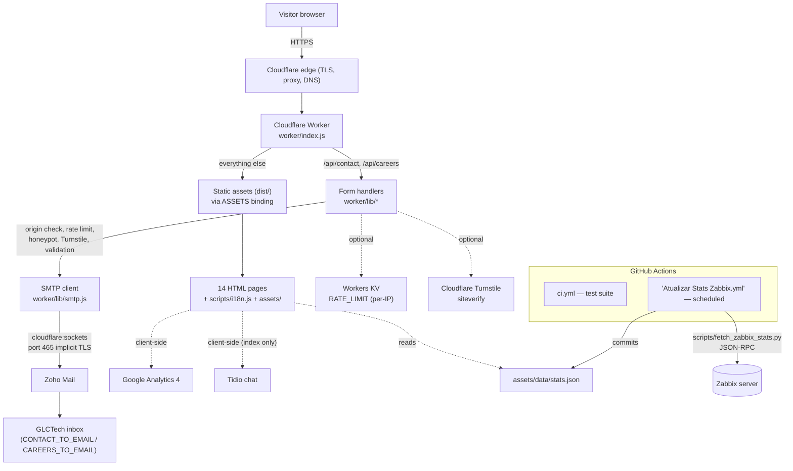
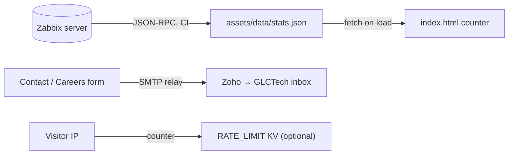
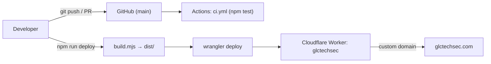

# Site Architecture — glctechsec.com

A single, authoritative description of how the GLCTech Sec website is built,
served, and integrated, derived from the actual repository contents
(`worker/`, `scripts/`, the page HTML, `wrangler.toml`, `.github/workflows/`).

This document is the **top-down architecture map**. Two companion docs go
deeper on specific subsystems and should be read alongside it:

- [`ARCHITECTURE.md`](ARCHITECTURE.md) — page-by-page and JavaScript-subsystem
  internals (i18n engine, language switcher, blog feed, stats pipeline).
- [`INTEGRATIONS.md`](INTEGRATIONS.md) — third-party integration setup.
- [`../AUDIT-REPORT.md`](../AUDIT-REPORT.md) — the forms/security audit, plus
  every out-of-repo action (Cloudflare secrets, Turnstile, DNS/SPF/DKIM/DMARC).

> **Verified vs. recommended.** Sections describe the **current
> implementation** unless a line is explicitly labelled *Recommended* or
> *Requires confirmation*. Nothing here documents behaviour that could not be
> traced to a file in this repository.

---

## 1. Architecture Overview

The site is a **static, multi-page, multilingual marketing website** with **no
front-end build framework** — the HTML in the repo is essentially what ships.
Internationalisation, the language switcher, form submission, the (hidden)
blog feed, and the live-stats counter are all plain browser JavaScript.

The only server-side component is a **single Cloudflare Worker**
(`worker/index.js`). One deploy does two jobs:

1. **Serves the static site** — every non-API request falls through to the
   built static assets in `dist/` (via the Worker's `ASSETS` binding), with
   security headers layered on top.
2. **Handles two form endpoints** — `POST /api/contact` and
   `POST /api/careers` are processed in-Worker and relayed by direct SMTP to
   Zoho Mail. Because the forms live on the same origin as the site, there is
   no CORS preflight and no third-party form service in the path.

The published asset set is assembled by `scripts/build.mjs`, an **allowlist**
build that copies only named files into `dist/` (so `node_modules/`, `tests/`,
`docs/`, and any local secret file can never be published by accident).

---

## 2. Architecture Diagram



---

## 3. Frontend Architecture

| Aspect | Implementation |
|---|---|
| **Framework** | None. Hand-authored HTML5 + CSS + vanilla JS. No bundler, no SPA. |
| **Layouts** | Per-page self-contained. Each page carries its own `<head>` `<style>` block; nav and footer are duplicated per page and kept in sync **by convention** (no includes). |
| **Shared runtime script** | `scripts/i18n.js` — the only JS shared across all pages (loaded as `scripts/i18n.js?v=r4`). Everything else is page-local `<script>` at the bottom of the body. |
| **State management** | None beyond `localStorage` (`glctech_lang` for language, `glc_rss_v6` for the blog cache). |
| **Routing** | No client router — each page is a distinct HTML file. Cloudflare serves them at clean, extensionless URLs (`/about-the-group` → `about-the-group.html`). |
| **Styling** | CSS custom properties (design tokens) defined in each page's `:root`; brand accent `--red: #e6262c`. Shared `css/styles.css` exists but pages are largely self-styled. See `ARCHITECTURE.md#the-shared-design-system`. |
| **Forms & validation** | Contact form (`index.html`) and careers form (`trabalhe-conosco.html`) validate client-side (localized errors via `window._i18n_errors`) and re-validate server-side in the Worker. |
| **Assets** | `assets/` (logos, team photos as WebP, service/hero/OG images, flags). Optimised to WebP in a prior revision. |
| **SEO** | Per-page meta description, canonical, Open Graph tags, favicon; `robots.txt` + `sitemap.xml` at root. |
| **i18n** | Client-side dictionary embedded in `scripts/i18n.js` (six languages: `pt`, `en`, `de`, `es`, `fr`, `it`). Full detail in [`I18N.md`](I18N.md). |

---

## 4. Website / Page Architecture

Pages published by `scripts/build.mjs` (the build allowlist is the source of
truth for what ships):

```text
/
├── index.html                 Home — one-page site (hero, about, services, team, contact)
├── about-the-group.html       About the GLCTech Group / GLCTech Sec relationship
├── trust-compliance.html      Trust & Compliance Centre (DPA, ICO, Cyber Essentials)
├── Services
│   ├── zabbix.html            Zabbix monitoring service + pricing simulator
│   ├── kaspersky.html         Security (vendor-agnostic) service + pricing simulator
│   └── veeam.html             Veeam backup service + pricing simulator
├── trabalhe-conosco.html      Careers — job listings + application form (PDF upload)
├── politica.html              Privacy Policy
├── termos.html                Terms of Use
└── (orphaned — published but unlinked from navigation)
    ├── landing.html           "Free IT diagnostic" campaign (still posts to FormSubmit.co)
    ├── ebook.html             Zabbix e-book lead magnet
    ├── mailmkt.html           HTML email template (renders in mail clients, not a web page)
    ├── andre.html             Team profile — André Luiz Cézar
    ├── kawan.html             Team profile — Kawan Pablo
    └── tchize.html            Team profile — Tchize Matias
```

Key pages:

| Page | Route | Primary components | Data / APIs | Key CTA |
|---|---|---|---|---|
| Home | `/` | Hero, stats strip, services cards, team, testimonials, contact form | `assets/data/stats.json` (live counter), `POST /api/contact`, GA4, Tidio | "Fale Conosco" / contact form |
| Careers | `/trabalhe-conosco` | Job listings, application form w/ résumé upload | `POST /api/careers` (multipart + PDF), GA4 | Submit application |
| Zabbix / Kaspersky / Veeam | `/zabbix`, `/kaspersky`, `/veeam` | Service detail, pricing simulator (currency by locale) | GA4 | Contact / quote |
| Trust & Compliance | `/trust-compliance` | DPA, ICO breach process, Cyber Essentials status | GA4 | Contact |
| Privacy / Terms | `/politica`, `/termos` | Legal copy | GA4 | — |

> **Orphaned pages** and `landing.html`'s separate FormSubmit.co flow are known,
> pre-existing follow-ups (see `AUDIT-REPORT.md` and `ARCHITECTURE.md`). They
> are still published by the build allowlist.

---

## 5. Backend Architecture

All server-side logic lives in `worker/`:

```text
worker/
├── index.js              Router: /api/contact, /api/careers, else → static assets
└── lib/
    ├── http.js           json() responses, security headers, same-origin check,
    │                     KV rate limiter, clean(), isValidEmail(), requestId()
    ├── smtp.js           Minimal SMTP client over cloudflare:sockets (+ MIME attach)
    ├── mail.js           Subject/body templates for the two internal emails
    ├── validate.js       Résumé PDF validation (extension + MIME + magic bytes + size)
    └── turnstile.js      Server-side Cloudflare Turnstile verification (siteverify)
```

**Request handling (both endpoints):**

1. `OPTIONS` → 204 preflight; non-`POST` → 405.
2. **Same-origin check** (`originAllowed`) → 403 if it fails.
3. **Content-Length guard** — 20 KB for contact, 8 MB for careers → 413.
4. **Content-Type check** — JSON for contact, `multipart/form-data` for careers.
5. **Rate limit** — 5 requests / 10 min per IP (`CF-Connecting-IP`), via KV
   `RATE_LIMIT` (skipped if the namespace is not bound) → 429.
6. **Honeypot** — a hidden `website` field; if filled, returns a fake success
   and sends nothing.
7. **Turnstile** — verified server-side; skipped gracefully until
   `TURNSTILE_SECRET_KEY` is set.
8. **Field validation** — required fields + `isValidEmail`; careers also runs
   `validateResumeFile` (magic-byte `%PDF-` check, 5 MB cap, filename sanitise).
9. **Mail** — fails closed with 500 if `ZOHO_USER`/`ZOHO_PASS` are unset;
   otherwise relays via SMTP with `Reply-To` set to the visitor's address.
   Errors are logged server-side but never returned to the browser.

**Authentication / authorisation:** the public site has no user accounts or
login. The only "auth" is (a) the Worker authenticating to Zoho over SMTP with
its secret credentials, and (b) the same-origin + Turnstile + rate-limit +
honeypot controls that gate the form endpoints.

---

## 6. Data Architecture

There is **no application database.** The site is stateless; the only
persistence layers are:

| Store | Technology | Purpose | Lifetime |
|---|---|---|---|
| `assets/data/stats.json` | Committed JSON file | Live "devices monitored" counter | Updated by scheduled CI |
| `RATE_LIMIT` KV (optional) | Cloudflare Workers KV | Per-IP form rate-limit counter | TTL-bounded (10 min window) |
| `localStorage['glctech_lang']` | Browser storage | Selected language | Per browser |
| `localStorage['glc_rss_v6']` | Browser storage | Blog-feed cache | 25 min |

**Caching:** Cloudflare edge caches static assets; the blog feed caches in
`localStorage` for 25 minutes. No server-side data cache.

**External data sources:** Zabbix (stats, via CI), plus the client-side blog
RSS feed (currently hidden). No customer data is stored — form submissions are
relayed by email and not persisted.



---

## 7. External Integrations

Only integrations actually present in the code/config:

| Integration | Where | Purpose | Secret / key |
|---|---|---|---|
| **Zoho Mail (SMTP)** | `worker/lib/smtp.js` | Deliver contact + careers emails | `ZOHO_USER`, `ZOHO_PASS` (Worker secrets) |
| **Cloudflare Turnstile** | `worker/lib/turnstile.js` + form HTML | Bot protection on both forms | `TURNSTILE_SECRET_KEY` (secret) + public site key in HTML |
| **Cloudflare Workers KV** | `worker/lib/http.js` | Optional per-IP rate limiting | `RATE_LIMIT` binding (`wrangler.toml`) |
| **Google Analytics 4** | Page `<head>` gtag | Web analytics | Public measurement ID `G-YDBB1PYYCM` |
| **Tidio** | `index.html` only | AI chat widget + proactive flow (draft) | Configured in Tidio dashboard |
| **Zabbix API** | `scripts/fetch_zabbix_stats.py` (CI) | Live device/problem counts | `ZABBIX_URL/USER/PASS` (Actions secrets) |
| **Blog RSS** | `index.html` IIFE (hidden) | Brazilian tech news feed | `RSS2JSON_KEY` (public, in IIFE) |

See [`INTEGRATIONS.md`](INTEGRATIONS.md) for setup details of each.

---

## 8. Infrastructure & Deployment Architecture

| Layer | Detail |
|---|---|
| **Hosting** | Cloudflare Workers (`name = "glctechsec"`, `wrangler.toml`). |
| **DNS** | Cloudflare-managed zone for `glctechsec.com`; `CNAME` file pins the custom domain. Email MX points to Zoho. |
| **CDN / TLS** | Cloudflare edge terminates HTTPS and caches assets. |
| **CI/CD** | GitHub Actions: `ci.yml` runs the test suite on PRs and pushes to `main`; `Atualizar Stats Zabbix.yml` refreshes stats on a schedule. |
| **Build** | `npm run build` → `scripts/build.mjs` assembles `dist/` from an allowlist and rejects any asset over Cloudflare's 25 MiB limit. |
| **Deploy** | `npm run deploy` = `npm run build && wrangler deploy`. Local preview: `npm run preview` = build + `wrangler dev`. |
| **Containers** | None. |



> **Requires confirmation:** `AUDIT-REPORT.md` notes that production may still
> be served by GitHub Pages if the Worker has not yet been deployed and the
> custom domain not yet attached. Deploying the Worker is a human action
> requiring Cloudflare account access. Until then, `POST /api/contact` on the
> live domain can return GitHub Pages' `405`.

---

## 9. Environment Configuration

Names and purposes only — **no secret values live in the repo.** Worker
secrets are set with `npx wrangler secret put <NAME>`; local values go in
`.dev.vars` (gitignored). Template: [`../.dev.vars.example`](../.dev.vars.example).

**Worker runtime (secrets):**

```text
ZOHO_USER            Zoho mailbox that authenticates outgoing SMTP
ZOHO_PASS            Zoho app-specific password (never the account password)
CONTACT_TO_EMAIL     Contact-form recipient (falls back to ZOHO_USER)
CAREERS_TO_EMAIL     Careers-form recipient (falls back to ZOHO_USER)
TURNSTILE_SECRET_KEY Cloudflare Turnstile secret (optional; verification skipped if unset)
```

**Worker bindings (`wrangler.toml`):**

```text
ASSETS               Static asset binding → ./dist
RATE_LIMIT           Workers KV namespace for per-IP rate limiting (optional; commented out until created)
```

**CI (GitHub Actions secrets, optional — stats stay static until set):**

```text
ZABBIX_URL / ZABBIX_USER / ZABBIX_PASS
```

**Client-side (public, embedded in HTML — not secrets):** GA4 `G-YDBB1PYYCM`,
Turnstile site key, `RSS2JSON_KEY`.

---

## 10. Security Architecture

**Controls that currently exist:**

- **TLS/HTTPS** terminated at the Cloudflare edge.
- **Security headers** on every response: static assets via the `_headers`
  file (CSP, `X-Content-Type-Options`, `Referrer-Policy`, `Permissions-Policy`,
  `X-Frame-Options`), API responses via `withSecurityHeaders` in
  `worker/lib/http.js`.
- **Same-origin enforcement** on both form endpoints (`originAllowed`).
- **Bot / abuse protection:** honeypot field, optional Cloudflare Turnstile
  (verified server-side), and per-IP rate limiting (5 / 10 min) when KV is bound.
- **File-upload hardening:** résumé uploads validated by extension **and**
  declared MIME **and** magic bytes, capped at 5 MB, filename sanitised.
- **Input handling:** all fields length-capped and cleaned (`clean()`); email
  format checked (`isValidEmail`).
- **Fail-closed mail:** endpoints return 500 rather than attempt delivery with
  missing credentials; SMTP errors are logged but never returned to clients.
- **Secrets management:** all credentials in Worker secrets / CI secrets, never
  in the repo; the allowlist build cannot publish a stray secret file.

**Recommended improvements (not yet in place — see `AUDIT-REPORT.md`):**

- **DMARC record** for `glctechsec.com` (SPF + DKIM exist; DMARC is absent).
- **Deploy the Worker + attach the custom domain** so the security headers and
  working contact endpoint actually reach production.
- **Create the Turnstile widget** and bind `RATE_LIMIT` KV for production
  traffic (both are currently optional and may be unconfigured).
- Confirm the DKIM selector for `glctech.com.br`.

---

## 11. Application / Data Flow

**Contact form:**

```text
Visitor
→ index.html (client-side validation, localized errors)
→ POST /api/contact (same-origin, JSON)
→ Worker: origin check → rate limit → honeypot → Turnstile → field validation
→ SMTP (cloudflare:sockets, port 465) → Zoho Mail
→ CONTACT_TO_EMAIL inbox (Reply-To = visitor)
→ { success, message } → success state
```

**Careers form:** same path via `POST /api/careers`, multipart, with résumé
PDF validated and attached as MIME `multipart/mixed`, delivered to
`CAREERS_TO_EMAIL`.

**Live stats:** scheduled Action → `fetch_zabbix_stats.py` → Zabbix JSON-RPC →
commit `assets/data/stats.json` → `index.html` fetches and animates the counter
(static fallback if the fetch fails).

---

## 12. Observability

| Concern | Current state |
|---|---|
| **Worker logging** | Each form request logs one minimal line (`[contact] <id> <status> <reason>`) — never the message body, credentials, or raw SMTP error. `[observability] enabled = true` in `wrangler.toml`. |
| **Live logs** | `npx wrangler tail`. |
| **Analytics** | Google Analytics 4 (`G-YDBB1PYYCM`) client-side. |
| **Error reporting** | No dedicated error-tracking service (e.g. Sentry). *Recommended* if form volume grows. |
| **Health checks** | None explicit; the site itself responding is the signal. *Recommended:* a lightweight uptime check on `/`. |

---

## 13. Known Architectural Risks

- **Deployment gap (highest).** If the Worker is not deployed / domain not
  attached, the live site lacks the working forms and security headers
  (`AUDIT-REPORT.md`). Single human action, high impact.
- **Missing DMARC** on `glctechsec.com` → spoofing / deliverability risk.
- **Duplicated page chrome.** Nav/footer/design tokens are copied across 14
  pages with no templating — a maintainability and drift risk.
- **Orphaned pages / legacy flow.** Several unlinked pages are still published;
  `landing.html` still posts to FormSubmit.co, bypassing the Worker.
- **Single points of failure.** Cloudflare (hosting + DNS + TLS) and Zoho
  (mail) are each single dependencies; a KV/Turnstile misconfig silently
  downgrades (not breaks) abuse protection.
- **Undocumented external config.** Tidio flows and the Turnstile/GA setup live
  in third-party dashboards, not in the repo.

---

## 14. Future Architecture Recommendations

### Priority 1 — Critical (security / reliability / data-loss)
- Deploy the Worker and attach the custom domain so forms + headers are live.
- Add a DMARC record for `glctechsec.com` (start `p=none`, then tighten).
- Bind the `RATE_LIMIT` KV namespace and create the Turnstile widget for
  production traffic.

### Priority 2 — Important (maintainability / operations)
- Introduce a lightweight templating/partials step (or components) to remove
  the duplicated nav/footer/tokens across pages.
- Resolve orphaned pages: link, migrate (`landing.html` → `/api/contact`), or
  remove. Decide the fate of the root `E-book …PDF` (untracked, unpublished).
- Add error reporting and a basic uptime/health check.

### Priority 3 — Optional (optimisation / DX)
- Extend DE/ES/FR/IT coverage for newer copy (currently English-first).
- Consider migrating SMTP to Zoho's HTTPS API (ZeptoMail) to drop the raw
  socket dependency.

> These recommendations are **not implemented automatically** — they require
> product/ops decisions and, in several cases, account access this repository
> does not have.
